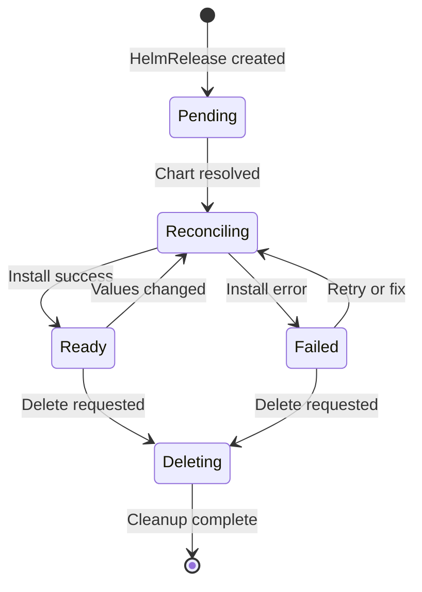
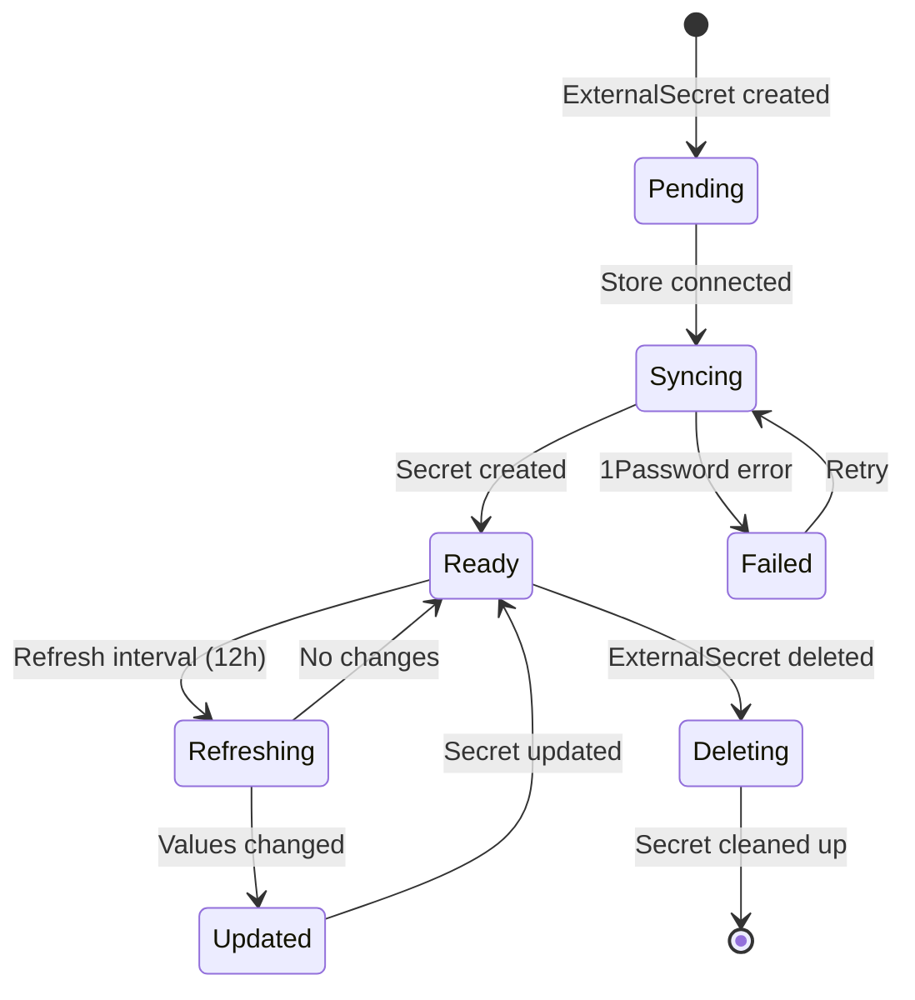
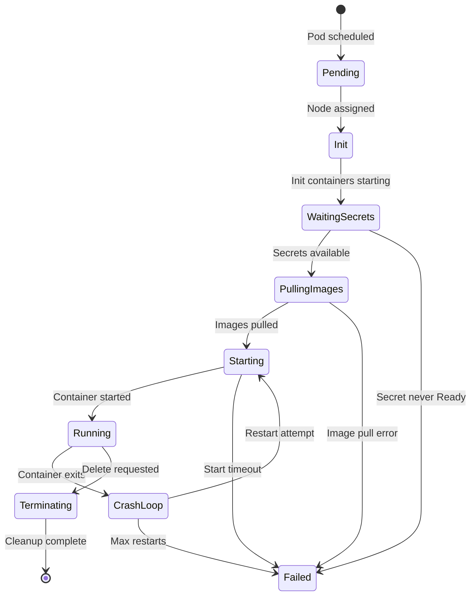
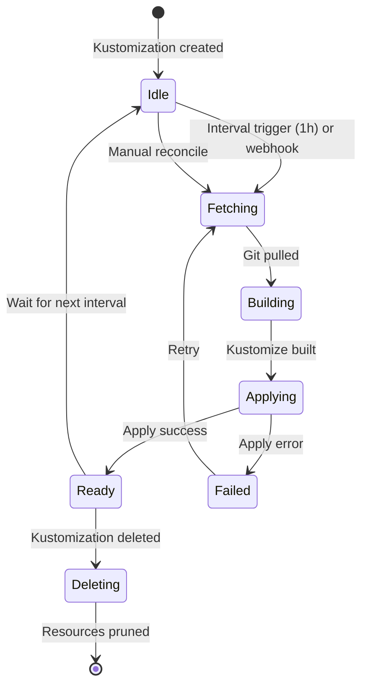
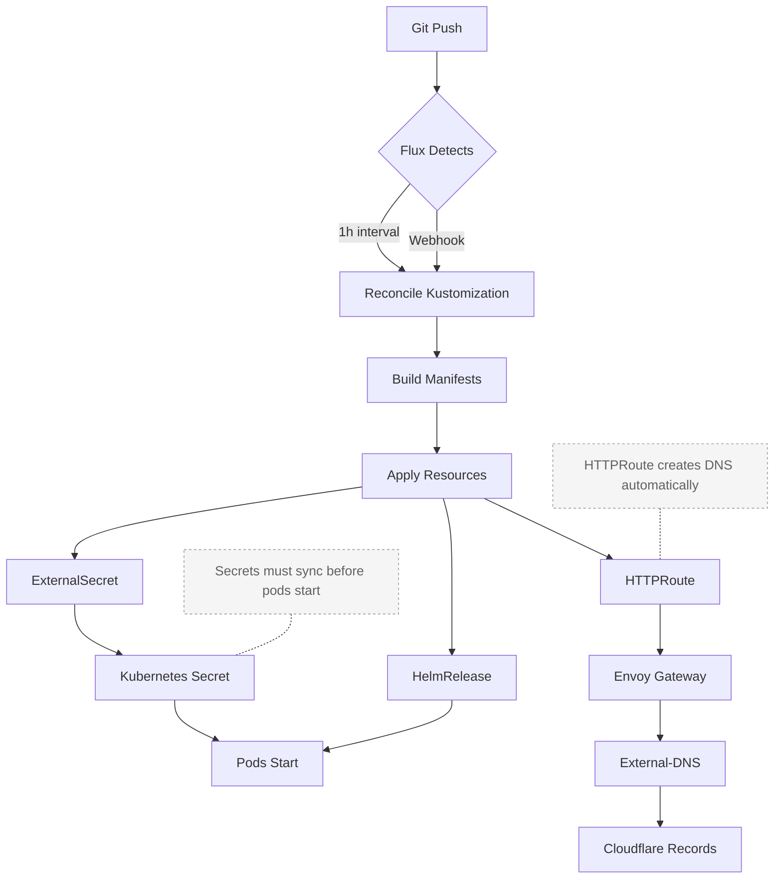
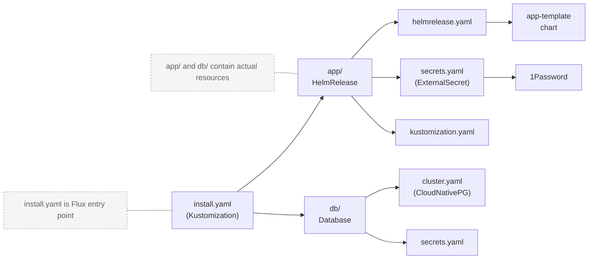

# Homelab Domain Model

**Purpose**: The conceptual model, business rules, and state machines that govern k8s-homelab infrastructure.

**Scope**: Domain logic and invariants, not implementation details (those are in ARCHITECTURE.md).

---

## Core Rules

### Rule 1: GitOps is the source of truth

**Rule**: All changes flow through Git. Manual cluster changes revert on next reconciliation.

**Enforced By**: Flux reconciliation loop (every 1 hour or on Git push webhook).

**Violation**: `kubectl edit --context main` changes are overwritten when Flux reconciles.

**Why**: Ensures cluster state is auditable, reproducible, and version-controlled.

---

### Rule 2: Clusters are independent islands

**Rule**: Main cluster (`kubernetes/main/`) and staging cluster (`kubernetes/staging/`) never share code, configuration, or state.

**Enforced By**: Separate directory trees, separate Flux instances, separate networks (10.11.x.x vs 10.12.x.x).

**Violation**: Copying manifests between clusters requires explicit manual action; no automation spans both.

**Why**: Production isolation ensures testing changes in staging never impacts main cluster.

---

### Rule 3: Secrets live in 1Password, not Git

**Rule**: All secrets pulled from 1Password via ExternalSecrets; never commit unencrypted secrets.

**Enforced By**: ExternalSecret resources with ClusterSecretStore `onepassword-connect`.

**Violation**: Missing 1Password entry blocks ExternalSecret sync, which blocks pod startup.

**Why**: Repository is public; secrets must stay encrypted and centralized.

---

### Rule 4: Apps use app-template chart

**Rule**: Default to `bjw-s/app-template` Helm chart; vendor charts only when necessary.

**Why**: Consistent structure, predictable patterns, easier maintenance across ~80+ apps.

**Exception**: Infrastructure components (cilium, cert-manager, cloudnative-pg) use vendor charts.

---

### Rule 5: Images are pinned by digest

**Rule**: Production images must include `@sha256:` digest; Renovate updates automatically.

**Enforced By**: Renovate automation monitoring all HelmReleases.

**Violation**: Using `:latest` or tags without digests creates non-reproducible deployments.

**Why**: Digest guarantees exact image version; tag alone can change.

---

### Rule 6: Templates are for Talos and bootstrap only

**Rule**: Jinja2 templates (`.j2` files) render locally before commit; used only for Talos node configs and bootstrap manifests.

**Enforced By**: `.minijinja.toml` configuration; manual rendering workflow.

**Violation**: Committing unrendered `.j2` files or expecting server-side rendering.

**Exception**: Unlike some repos, k8s-homelab doesn't template HelmRelease manifests (those are static YAML).

---

## State Machines

### Flux HelmRelease Lifecycle



**State Transitions**:

| From         | To          | Trigger                                     | Duration            |
| ------------ | ----------- | ------------------------------------------- | ------------------- |
| Pending      | Reconciling | Chart and values resolved                   | Seconds             |
| Reconciling  | Ready       | Helm install/upgrade success                | 30s-5m              |
| Reconciling  | Failed      | Chart error, missing secret, invalid values | Variable            |
| Ready        | Reconciling | Git push with changed values                | Immediate           |
| Failed       | Reconciling | Remediation retry (max 3)                   | Exponential backoff |
| Ready/Failed | Deleting    | HelmRelease deleted from Git                | Immediate           |

**Critical Insight**: `Ready` state means Helm succeeded, NOT that pods are healthy. Pod failures appear in `kubectl get pods --context main`, not HelmRelease status.

---

### ExternalSecret Lifecycle



**State Transitions**:

| From    | To         | Trigger                               | Blocks Pods? |
| ------- | ---------- | ------------------------------------- | ------------ |
| Pending | Syncing    | ClusterSecretStore ready              | Yes          |
| Syncing | Ready      | 1Password entry found and pulled      | No           |
| Syncing | Failed     | Missing entry, wrong path, store down | Yes          |
| Ready   | Refreshing | 12h interval or manual refresh        | No           |
| Failed  | Syncing    | Retry after exponential backoff       | Yes          |

**Critical Dependencies**:

- ExternalSecret MUST be Ready before pods referencing the secret can start
- onepassword-connect MUST be running before any ExternalSecret can sync
- 1Password vault MUST contain entry at specified path

---

### Pod Lifecycle



**Common Failure Points**:

| State          | Common Causes                      | Fix                                                 |
| -------------- | ---------------------------------- | --------------------------------------------------- |
| WaitingSecrets | ExternalSecret not Ready           | Check ExternalSecret status, verify 1Password entry |
| PullingImages  | Wrong image tag, missing digest    | Verify image exists, check registry auth            |
| CrashLoop      | App config error, missing env vars | Check logs, verify ExternalSecret template          |
| Pending        | PVC not bound, node affinity       | Check PVC status, verify node labels                |

---

### Flux Reconciliation States



**Timing**:

- Default interval: 1 hour
- Webhook trigger: Immediate (if configured)
- Manual trigger: `flux reconcile kustomization <name> --context main`
- Retry on failure: Exponential backoff

---

## Entity Relationships

### Deployment Flow



### Resource Dependencies

| Resource       | Depends On                                   | Blocks      | Prune Behavior |
| -------------- | -------------------------------------------- | ----------- | -------------- |
| HelmRelease    | Chart source, ExternalSecret (if referenced) | Pods        | Cascade delete |
| ExternalSecret | ClusterSecretStore, 1Password entry          | Pods        | Delete secret  |
| HTTPRoute      | Gateway, Service                             | DNS records | Delete route   |
| PVC            | StorageClass                                 | Pods        | Retained       |
| Pod            | Secret, PVC, Image                           | Nothing     | Immediate      |

### Secret Flow

| Stage  | State                  | Location        | Encrypted?    |
| ------ | ---------------------- | --------------- | ------------- |
| Source | 1Password vault entry  | 1Password cloud | Yes           |
| Pull   | ExternalSecret syncing | Cluster memory  | No            |
| Store  | Kubernetes Secret      | etcd            | Yes (at rest) |
| Mount  | Pod environment/volume | Container       | No            |

**Critical Path**: 1Password → onepassword-connect → ExternalSecret controller → Kubernetes Secret → Pod

**Failure Impact**: Any failure in this chain blocks pod startup indefinitely.

---

### App Structure Triad



**Pattern**:

```
kubernetes/{main,staging}/apps/<namespace>/<app>/
├── install.yaml           # Flux Kustomization (entry)
├── app/                   # Application resources
│   ├── helmrelease.yaml  # App deployment
│   ├── secrets.yaml      # ExternalSecret
│   └── kustomization.yaml
└── db/                    # Database (optional)
    ├── cluster.yaml      # CloudNativePG
    ├── secrets.yaml      # Database ExternalSecret
    └── kustomization.yaml
```

---

## Business Rules and Constraints

### Capsule: OrderedBootstrap

**Invariant**: Infrastructure components must start before applications; dependencies enforce order.

**Bootstrap Order**:

1. Cilium (networking) - Nothing works without CNI
2. CoreDNS (DNS) - Required for service discovery
3. Spegel (image cache) - Accelerates image pulls
4. Cert-Manager (certificates) - Required for HTTPS
5. External-Secrets (secrets) - Required for app secrets
6. CloudNative-PG (database operator) - Required for databases
7. Envoy Gateway (routing) - Required for HTTPRoutes
8. Applications - Can start after infrastructure ready

**Enforcement**: `dependsOn` in install.yaml files create dependency graph.

**Example**:

```yaml
# immich install.yaml
dependsOn:
  - name: external-secrets
    namespace: external-secrets
  - name: cloudnative-pg-operator
    namespace: dbms
  - name: envoy-gateway
    namespace: network
```

---

### Capsule: StorageClassSelection

**Invariant**: Storage class determines performance, capacity, and redundancy characteristics.

**Decision Matrix**:

| Use Case           | StorageClass           | Backed By    | Performance | Capacity | Redundancy |
| ------------------ | ---------------------- | ------------ | ----------- | -------- | ---------- |
| Database, fast I/O | `rook-ceph-block`      | NVMe SSD     | High        | Limited  | 3x replica |
| Shared files       | `rook-ceph-filesystem` | NVMe SSD     | Medium      | Limited  | 3x replica |
| Large media        | NFS mounts             | Synology NAS | Low         | Multi-TB | RAID       |
| Cache, temp        | `emptyDir`             | Node memory  | Highest     | Tiny     | None       |

**Rules**:

- Databases → rook-ceph-block (fast, replicated)
- App configs → rook-ceph-block (small, persistent)
- Media downloads → NFS (large capacity)
- Caches → emptyDir or tmpfs (ephemeral)

**Trade-offs**:

- Ceph: Fast but limited capacity
- NFS: Large but slower
- emptyDir: Fastest but lost on pod restart

---

### Capsule: GatewaySelection

**Invariant**: Gateway determines network exposure and access path.

**Decision Matrix**:

| Access Pattern   | Gateway           | IP Address        | DNS         | Authentication |
| ---------------- | ----------------- | ----------------- | ----------- | -------------- |
| Public internet  | `envoy-external`  | 10.11.1.22 (main) | Public DNS  | App-level      |
| Private LAN only | `envoy-internal`  | 10.11.1.21 (main) | Private DNS | Network-level  |
| VPN only         | Cloudflare Tunnel | N/A               | CNAME       | Cloudflare     |

**Rules**:

- Home Assistant → envoy-internal (LAN only)
- Immich → envoy-external (accessible remotely)
- Plex → envoy-external (Plex apps need external)
- Internal tools → envoy-internal (security)

**Gateway Configuration**:

```yaml
# Internal LAN access
route:
  main:
    parentRefs:
      - name: envoy-internal
        namespace: network
        sectionName: https

# Public internet access
route:
  main:
    parentRefs:
      - name: envoy-external
        namespace: network
        sectionName: https
```

---

### Capsule: SecretTemplating

**Invariant**: ExternalSecrets can compose values from multiple 1Password fields using templates.

**Pattern**: Complex secrets (database URLs, multi-value configs) built from individual fields.

**Example**:

```yaml
target:
  template:
    data:
      # Composed from individual fields
      DB_URL: "postgres://{{ .DB_USERNAME }}:{{ .DB_PASSWORD }}@host:5432/db"

      # Direct mapping
      JWT_SECRET: "{{ .JWT_SECRET }}"

      # YAML config file from template
      config.yaml: |
        database:
          url: postgres://{{ .DB_USERNAME }}:{{ .DB_PASSWORD }}@host:5432/db
dataFrom:
  - extract:
      key: immich # 1Password item name
  - extract:
      key: cloudnative-pg-superuser # Additional item
```

**Why**: Secrets in 1Password stored as individual fields; apps need composed values.

---

### Capsule: ImagePullOptimization

**Invariant**: Spegel mirrors images across cluster nodes to reduce external registry pulls.

**Flow**:

1. First pod on cluster pulls from registry (e.g., ghcr.io)
2. Spegel caches image on that node
3. Spegel peers share image across cluster
4. Subsequent pods pull from local Spegel mirror

**Why**: Faster deployments, reduced bandwidth, resilience to registry outages.

**Limitation**: Cold starts still hit external registry; no pre-warming.

---

## Value Objects

### HelmRelease Specification

**Properties**:

- `namespace`: Where resources deploy
- `name`: Release name (typically matches app)
- `chartRef`: Reference to OCIRepository or HelmRepository
- `interval`: How often to check for updates (1h standard)
- `values`: Chart values (app configuration)
- `dependsOn`: Deployment dependencies

**Constraints**:

- Name must be unique within namespace
- ChartRef must reference existing source
- Values must match chart schema
- Interval must be duration format (e.g., "1h", "30m")

**Standard Fields**:

```yaml
spec:
  interval: 1h
  chartRef:
    kind: OCIRepository
    name: app-template
  maxHistory: 3
  install:
    remediation:
      retries: 3
  upgrade:
    cleanupOnFail: true
    remediation:
      retries: 3
```

---

### ExternalSecret Specification

**Properties**:

- `secretStoreRef`: ClusterSecretStore reference
- `target`: Kubernetes Secret to create
- `refreshInterval`: How often to sync (12h default)
- `dataFrom`: 1Password items to extract
- `template`: Optional templating for composed values

**Constraints**:

- secretStoreRef must be `onepassword-connect` (ClusterSecretStore)
- 1Password item must exist at specified path
- Template syntax is Go template
- Refresh interval minimum: 1m

**Standard Pattern**:

```yaml
spec:
  refreshInterval: 12h
  secretStoreRef:
    kind: ClusterSecretStore
    name: onepassword-connect
  target:
    name: app-secret
    creationPolicy: Owner
  dataFrom:
    - extract:
        key: app-name # 1Password item
```

---

### HTTPRoute Specification

**Properties**:

- `hostnames`: DNS names for route
- `parentRefs`: Gateway(s) to attach to
- `rules`: Routing rules and backend services

**Constraints**:

- Hostnames must be valid DNS names
- ParentRefs must reference existing Gateway
- Namespace must match Gateway or use ReferenceGrant
- Backend service must exist

**Standard Pattern**:

```yaml
route:
  main:
    hostnames:
      - "{{ .Release.Name }}.${SECRET_DOMAIN}"
    parentRefs:
      - name: envoy-internal # or envoy-external
        namespace: network
        sectionName: https
    rules:
      - backendRefs:
          - name: app-name
            port: 8080
```

---

## Domain Events

### FluxReconciled

**Trigger**: Git push webhook or 1h interval expires

**Contains**:

- Kustomization name
- Applied resources count
- Status (Ready/Failed)
- Revision SHA

**Consumers**: All HelmReleases in Kustomization scope

**Effects**:

- HelmReleases check for value changes
- Outdated resources pruned (if prune enabled)
- Status reported to GitHub (via flux-config)

---

### SecretSynced

**Trigger**: ExternalSecret successfully pulls from 1Password

**Contains**:

- Secret name and namespace
- Sync timestamp
- Source (1Password item path)

**Consumers**:

- Pods waiting for secret
- Reloader (triggers pod restart if secret changed)

**Effects**:

- Kubernetes Secret created/updated
- Pods unblocked and start
- Reloader annotation triggers rolling restart

---

### HelmReleaseReady

**Trigger**: Helm install/upgrade completes successfully

**Contains**:

- Release name and namespace
- Chart version
- Applied values
- Timestamp

**Consumers**: Dependent HelmReleases (via `dependsOn`)

**Effects**:

- Blocked HelmReleases can proceed
- Resources created in cluster
- Status updated in Git (via Flux)

---

### HTTPRouteCreated

**Trigger**: HTTPRoute applied to cluster

**Contains**:

- Hostnames
- Gateway references
- Backend services

**Consumers**:

- Envoy Gateway (configures routing)
- External-DNS (creates DNS records)

**Effects**:

- Envoy adds routes to gateway
- DNS A/CNAME records created in Cloudflare
- Traffic flows to services

---

## Temporal Rules

### Reconciliation Timing

| Component          | Interval  | Trigger         | Jitter   |
| ------------------ | --------- | --------------- | -------- |
| Flux Kustomization | 1h        | Webhook, manual | None     |
| HelmRelease        | 1h        | Values change   | None     |
| ExternalSecret     | 12h       | Manual refresh  | Up to 1m |
| Renovate           | Daily 2AM | Scheduled       | None     |

**Why Different Intervals**:

- Flux: Hourly catches Git changes if webhook fails
- HelmRelease: Matches Flux (parent Kustomization drives it)
- ExternalSecret: Infrequent to reduce 1Password API load
- Renovate: Daily to batch updates

---

### Retry Behavior

| Resource       | Max Retries | Backoff              | Timeout |
| -------------- | ----------- | -------------------- | ------- |
| HelmRelease    | 3           | Exponential          | 5m      |
| ExternalSecret | Infinite    | Exponential          | None    |
| Pod            | Infinite    | Exponential (max 5m) | None    |
| Image pull     | 3           | None                 | 1m      |

**Key Differences**:

- HelmRelease gives up after 3 failures (requires manual fix)
- ExternalSecret retries forever (eventual consistency)
- Pods restart forever with increasing backoff (CrashLoopBackOff)

---

### Lifecycle Durations

| Operation             | Typical Duration | Timeout  |
| --------------------- | ---------------- | -------- |
| Flux reconcile        | 10-30s           | 5m       |
| HelmRelease install   | 1-5m             | 10m      |
| ExternalSecret sync   | 2-10s            | 1m       |
| Image pull (cached)   | 1-5s             | 1m       |
| Image pull (uncached) | 10s-2m           | 5m       |
| Pod startup           | 10s-1m           | Variable |

---

## Anti-Patterns

### Don't: Edit Generated Files

**Wrong**:

```bash
# Editing Talos config after it's been rendered
vim kubernetes/main/talos/nodes/k8s-1.yaml  # Generated from .j2
git commit -m "Changed hostname"
```

**Right**:

```bash
# Edit the template source
vim kubernetes/main/talos/nodes/k8s-1.yaml.j2
# Render with environment variables set
HOSTNAME=k8s-1 MAC_ADDRESS=... minijinja-cli kubernetes/main/talos/nodes/k8s-1.yaml.j2 > kubernetes/main/talos/nodes/k8s-1.yaml
git commit -m "Changed hostname"
```

**Why**: Re-rendering templates overwrites manual edits.

---

### Don't: Use kubectl for Permanent Changes

**Wrong**:

```bash
kubectl edit deployment immich-server -n media --context main
# Change image tag
# Save and exit
```

**Right**:

```bash
# Edit HelmRelease in Git
vim kubernetes/main/apps/media/immich/app/helmrelease.yaml
# Update image tag
git commit -m "Update immich to v2.4.2"
git push
# Flux reconciles within 1 hour (or trigger manually)
flux reconcile kustomization media -n flux-system --context main
```

**Why**: GitOps reverts kubectl changes. Git is source of truth.

---

### Don't: Share Code Between Clusters

**Wrong**:

```yaml
# Symlinking staging to main
kubernetes/staging/apps/media -> ../../main/apps/media
```

**Right**:

```bash
# Copy and modify explicitly
cp -r kubernetes/main/apps/media/immich kubernetes/staging/apps/media/immich
# Make staging-specific changes
vim kubernetes/staging/apps/media/immich/app/helmrelease.yaml
```

**Why**: Clusters must be independent. Shared code breaks isolation.

---

### Don't: Use :latest Tag

**Wrong**:

```yaml
image:
  repository: ghcr.io/immich-app/immich-server
  tag: latest
```

**Right**:

```yaml
image:
  repository: ghcr.io/immich-app/immich-server
  tag: v2.4.1@sha256:e6a6298e67ae077808fdb7d8d5565955f60b0708191576143fc02d30ab1389d1
```

**Why**: `:latest` changes unpredictably. Digest pins exact version.

---

### Don't: Hardcode Secrets

**Wrong**:

```yaml
env:
  DB_PASSWORD: "mySecretPassword123"
```

**Right**:

```yaml
# In secrets.yaml (ExternalSecret)
target:
  template:
    data:
      DB_PASSWORD: "{{ .DB_PASSWORD }}"
dataFrom:
  - extract:
      key: immich # From 1Password

# In helmrelease.yaml
envFrom:
  - secretRef:
      name: immich-secret
```

**Why**: Public repository. Secrets must come from 1Password.

---

### Don't: Skip Dependencies

**Wrong**:

```yaml
# install.yaml with no dependsOn
# But app uses ExternalSecret and CloudNativePG database
spec:
  path: ./kubernetes/main/apps/media/immich/app
```

**Right**:

```yaml
spec:
  dependsOn:
    - name: external-secrets
      namespace: external-secrets
    - name: cloudnative-pg-operator
      namespace: dbms
  path: ./kubernetes/main/apps/media/immich/app
```

**Why**: Missing dependencies cause race conditions and startup failures.

---

## Glossary

| Term                    | Definition                                                            |
| ----------------------- | --------------------------------------------------------------------- |
| **app-template**        | bjw-s Helm chart providing consistent app deployment patterns         |
| **Cilium**              | CNI and network policy provider (L3/L4 networking)                    |
| **ClusterSecretStore**  | External-Secrets resource defining 1Password connection               |
| **CloudNative-PG**      | PostgreSQL operator for managed database clusters                     |
| **Envoy Gateway**       | Gateway API implementation for HTTP/HTTPS routing                     |
| **ExternalSecret**      | External-Secrets resource syncing from 1Password to Kubernetes Secret |
| **Flux**                | GitOps operator synchronizing cluster state to Git                    |
| **Gateway API**         | Kubernetes routing API replacing Ingress (HTTPRoute, Gateway)         |
| **GitOps**              | Infrastructure as code pattern where Git is source of truth           |
| **HelmRelease**         | Flux resource managing Helm chart deployment                          |
| **HTTPRoute**           | Gateway API resource defining HTTP routing rules                      |
| **Kustomization**       | Flux resource defining what to apply from Git path                    |
| **OCIRepository**       | Flux resource for OCI registry-hosted Helm charts                     |
| **onepassword-connect** | 1Password service providing API access to vaults                      |
| **Renovate**            | Automation bot updating dependencies (images, charts, actions)        |
| **Rook-Ceph**           | Distributed storage system on NVMe drives                             |
| **Spegel**              | Peer-to-peer image cache across cluster nodes                         |
| **Talos**               | Immutable Linux OS for Kubernetes nodes                               |
| **VolSync**             | Backup replication using Restic or Rclone                             |

---

## Evidence

| Claim                                     | Source                                                    | Confidence |
| ----------------------------------------- | --------------------------------------------------------- | ---------- |
| Flux reconciles every 1h                  | `kubernetes/main/apps/*/install.yaml` interval field      | Verified   |
| HelmRelease retries 3 times               | `kubernetes/main/apps/*/app/helmrelease.yaml` remediation | Verified   |
| ExternalSecret refresh 12h                | `kubernetes/main/apps/*/app/secrets.yaml` refreshInterval | Verified   |
| ClusterSecretStore is onepassword-connect | ExternalSecret secretStoreRef in all secrets.yaml         | Verified   |
| Two independent clusters                  | `kubernetes/main/` and `kubernetes/staging/` directories  | Verified   |
| App-template chart standard               | HelmRelease chartRef across 80+ apps                      | Verified   |
| Image digest pinning                      | SHA256 in helmrelease.yaml image tags                     | Verified   |
| Gateway names                             | envoy-internal (10.11.1.21), envoy-external (10.11.1.22)  | Verified   |
| Storage classes                           | rook-ceph-block, rook-ceph-filesystem in PVC specs        | Verified   |
| Renovate automation                       | `.renovaterc.json5`, automated PRs                        | Verified   |
| Jinja2 for Talos only                     | `*.j2` files only in `talos/` and `bootstrap/` dirs       | Verified   |
| Dependencies enforced                     | `dependsOn` in install.yaml files                         | Verified   |

---

## Operational Patterns

### Capsule: FluxDependencyChain

**Invariant**: Apps declare dependencies; Flux waits for dependencies to be Ready before proceeding.

**Pattern**: Infrastructure → Operators → Databases → Applications

**Example Dependency Chain**:

```
Cilium (networking)
  ↓
CoreDNS (DNS)
  ↓
External-Secrets (operator)
  ↓
onepassword-connect (secrets provider)
  ↓
CloudNative-PG (database operator)
  ↓
immich database (PostgreSQL cluster)
  ↓
immich app (photo management)
```

**Enforcement**: Each install.yaml declares `dependsOn` for prerequisites.

**Failure Mode**: If dependency fails, all downstream apps block indefinitely.

---

### Capsule: SecretRefreshCycle

**Invariant**: ExternalSecrets refresh from 1Password every 12 hours; changes trigger pod restarts via Reloader.

**Flow**:

1. ExternalSecret syncs from 1Password (12h interval)
2. Kubernetes Secret updated if values changed
3. Reloader detects Secret change (annotation monitoring)
4. Reloader triggers rolling restart of pods
5. Pods pick up new secret values

**Annotation**:

```yaml
controllers:
  server:
    annotations:
      secret.reloader.stakater.com/reload: immich-secret
```

**Why**: Apps don't auto-detect secret changes; restart required.

---

### Capsule: ImageUpdateFlow

**Invariant**: Renovate detects new images, creates PR with updated tag+digest, auto-merges if tests pass.

**Flow**:

1. Renovate scans HelmRelease files (daily 2AM)
2. Detects new image version (e.g., immich v2.4.1 → v2.4.2)
3. Fetches new SHA256 digest from registry
4. Creates PR updating both tag and digest
5. CI validates manifests (kubeconform)
6. Auto-merges if patch/minor and tests pass
7. Flux reconciles within 1h
8. HelmRelease upgrades with new image

**Why**: Manual updates don't scale to 80+ apps; automation ensures security patches.

---

## Common Failure Scenarios

### Scenario: Pod Stuck in CrashLoopBackOff

**Symptoms**: Pod restarts repeatedly, back-off increases to 5m

**Root Causes**:

1. **App configuration error** - Invalid config file, missing required env var
2. **Database unreachable** - DB_URL wrong, database not ready
3. **Missing secret value** - ExternalSecret template has undefined field

**Diagnosis**:

```bash
kubectl logs -n media pod/immich-server-xyz --previous --context main  # Last crash
kubectl describe pod -n media immich-server-xyz --context main  # Events
kubectl get externalsecret -n media immich --context main  # Secret status
```

**Resolution**:

- Check ExternalSecret is Ready
- Verify 1Password has all required fields
- Check logs for specific error
- Validate app config in ExternalSecret template

---

### Scenario: HelmRelease Stuck Reconciling

**Symptoms**: HelmRelease shows "Reconciling" for >5 minutes

**Root Causes**:

1. **Missing ExternalSecret** - Referenced secret not Ready
2. **Invalid chart values** - Schema validation failure
3. **Timeout** - Large image download or slow storage
4. **Dependency not met** - dependsOn target not Ready

**Diagnosis**:

```bash
flux get helmrelease -n media immich --context main  # Status
kubectl describe helmrelease -n media immich --context main  # Events
kubectl get externalsecret -n media --context main  # Check secrets
flux get kustomization --context main  # Check dependencies
```

**Resolution**:

- Ensure ExternalSecrets are Ready
- Validate HelmRelease values against schema
- Check dependsOn targets are Ready
- Increase timeout if needed

---

### Scenario: ExternalSecret Failed to Sync

**Symptoms**: ExternalSecret shows "Failed" status, pod pending

**Root Causes**:

1. **Missing 1Password entry** - Item doesn't exist at specified path
2. **Wrong path** - Typo in 1Password item name
3. **onepassword-connect down** - Service not running
4. **Template error** - Invalid Go template syntax

**Diagnosis**:

```bash
kubectl describe externalsecret -n media immich --context main  # Error details
kubectl logs -n external-secrets deploy/external-secrets --context main  # Controller logs
kubectl logs -n external-secrets deploy/onepassword-connect --context main  # 1Password logs
```

**Resolution**:

- Verify 1Password item exists (check vault in 1Password app)
- Correct path in ExternalSecret dataFrom.extract.key
- Restart onepassword-connect if crashed
- Fix template syntax errors

---

### Scenario: HTTPRoute Not Working

**Symptoms**: DNS resolves but connection refused or 404

**Root Causes**:

1. **Gateway not ready** - Envoy Gateway pods not running
2. **Wrong parentRefs** - Gateway name or namespace incorrect
3. **Backend service missing** - Service doesn't exist
4. **External-DNS not synced** - DNS record not created

**Diagnosis**:

```bash
kubectl get gateway -n network --context main  # Check gateways
kubectl describe httproute -n media immich-main --context main  # Route status
kubectl get svc -n media --context main  # Backend services
kubectl logs -n network deploy/external-dns --context main  # DNS sync logs
```

**Resolution**:

- Verify gateway exists and is Ready
- Check parentRefs match gateway name/namespace
- Ensure backend service exists with correct port
- Trigger external-dns sync or wait for interval

---

**See Also**:

- `ARCHITECTURE.md` - System architecture and implementation details
- `NETWORKING.md` - Traffic flows, DNS, and routing configuration
- `WORKFLOWS.md` - Operational procedures and troubleshooting
- `CONVENTIONS.md` - Coding standards and naming patterns
- `Ethos.md` - Documentation philosophy and principles
