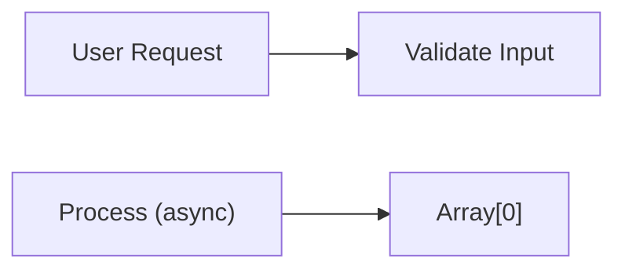
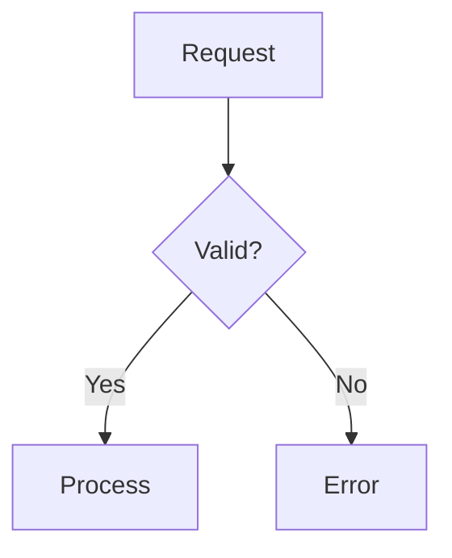
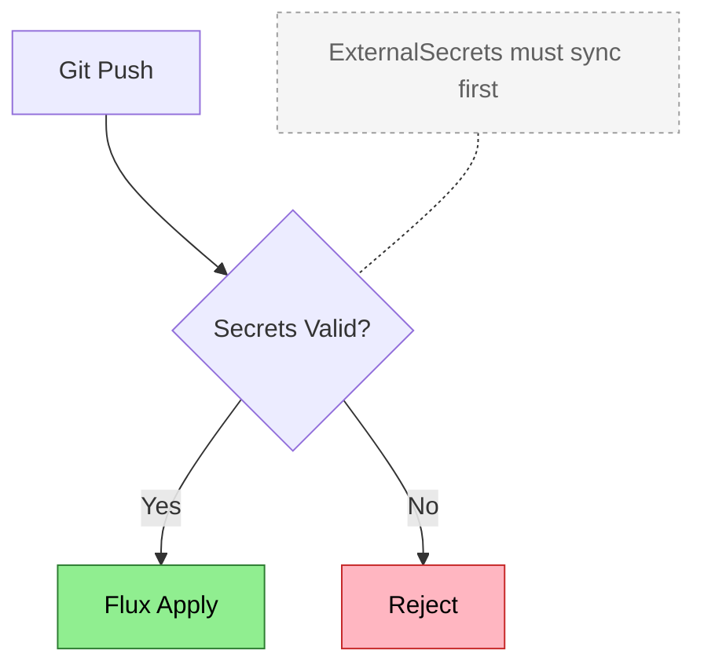
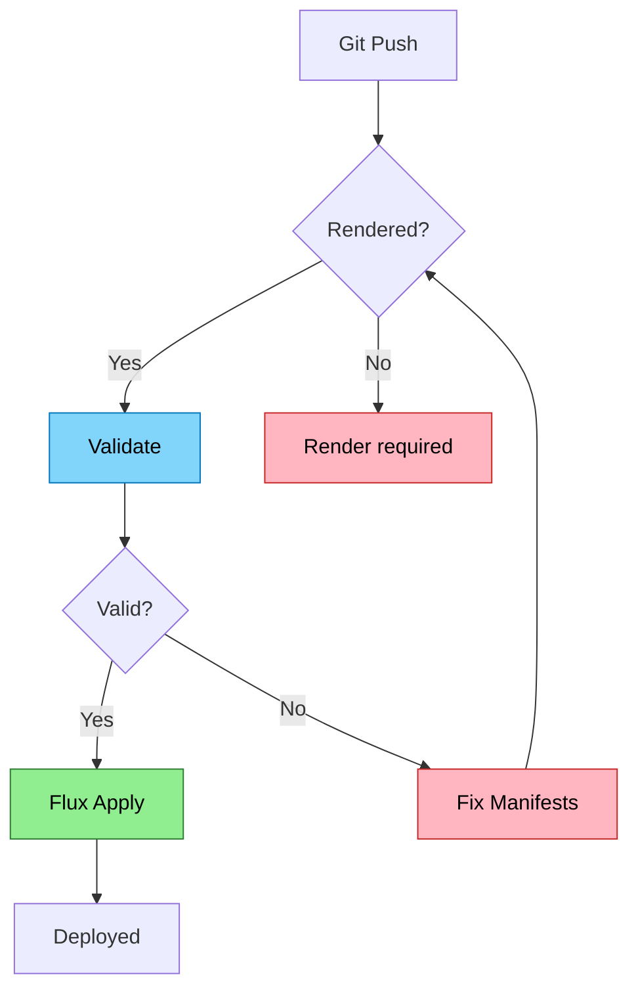
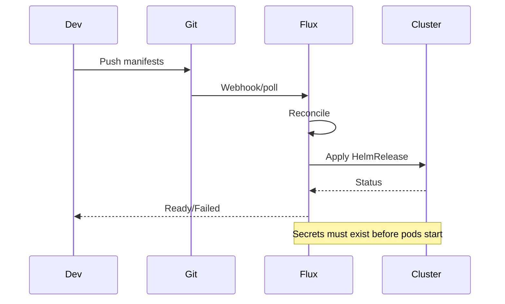
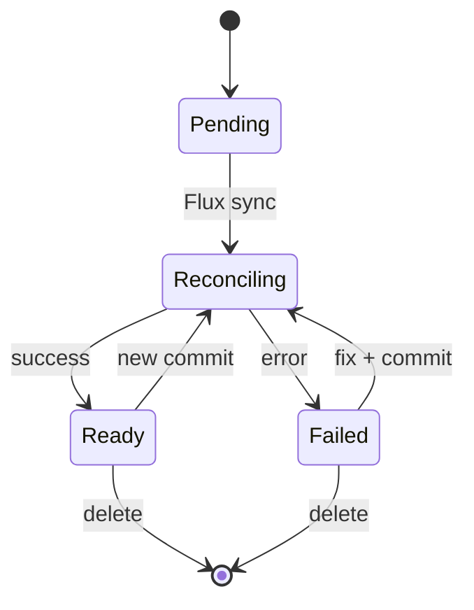
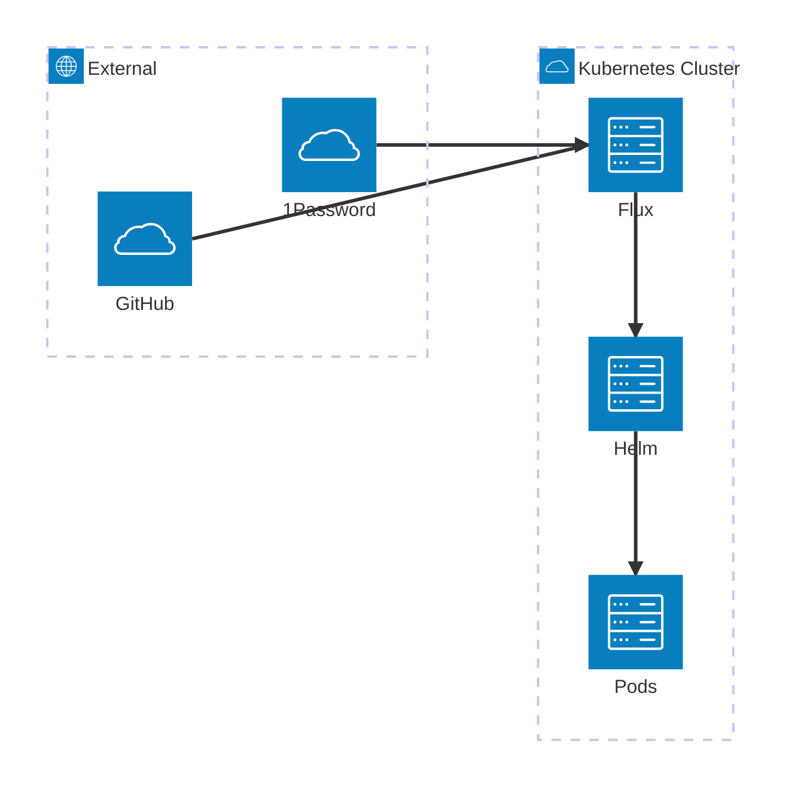
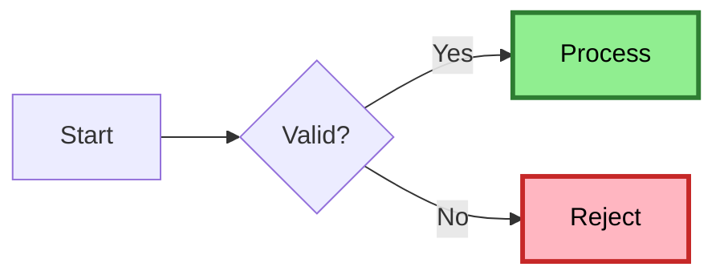

# Mermaid Diagram Guide

**Purpose**: Create information-dense, accessible diagrams that enhance understanding.

**Core Principle**: Diagrams reveal relationships that prose cannot express efficiently. If a list or table works, use that instead.

---

## When to Use Diagrams

### The Decision Test

**Ask these questions before creating a diagram**:

1. **Does it show relationships?** If no relationships, use a table or list.
2. **Are there branches or decisions?** If linear (A->B->C->D), use a numbered list.
3. **Would prose be clearer?** Simple things don't need diagrams.
4. **Is it scannable in 10 seconds?** Complex diagrams waste time.

### Value Proposition

**Good diagrams**:
- Reveal patterns instantly (architecture, flows, relationships)
- Show multiple dimensions simultaneously (actors, time, state)
- Make complex systems comprehensible
- Enable pattern recognition

**Bad diagrams**:
- Waste tokens on information better shown in lists
- Confuse readers with unnecessary complexity
- Look impressive but convey little
- Require more time to understand than prose

---

## Universal Rules

### Rule 1: NEVER Diagram Linear Sequences

This is the cardinal rule that must never be violated.

**NEVER do this**:


**Always use list**:
```markdown
1. Step 1
2. Step 2
3. Step 3
4. Step 4
```

**Test**: If there are no branches, decisions, or parallel paths -> use a list, not a diagram.

### Rule 2: Escape All Labels with Spaces

**Critical**: Labels containing spaces MUST be quoted or rendering breaks.



**Characters requiring quotes**:
- Spaces: `"User Request"`
- Parentheses: `"Process (async)"`
- Brackets: `"Array[0]"`
- Colons: `"Key: Value"`
- Commas: `"Name, Inc"`

**NEVER use list-like formats in labels or relationships**:
```
BAD: A -->|1. Do thing| B
BAD: A["1. First step"] --> B["2. Second step"]
GOOD: A -->|Do thing| B
GOOD: A["First step"] --> B["Second step"]
```

List numbering (1. 2. 3.) breaks Mermaid syntax. Use plain text or letters if ordering is needed.

**Escape markdown syntax in labels and relationships**:

| Character | Problem | Solution |
|-----------|---------|----------|
| `>` | Interpreted as arrow | `\>` or quote the label |
| `<` | Interpreted as arrow | `\<` or quote the label |
| `-` at start | List syntax | `\-` or rephrase |
| `1.` at start | Numbered list | `1\.` or rephrase |

### Rule 3: Add Meaning Comments

**Pattern**: Use `%%` to explain non-obvious aspects for AI agents and future maintainers.



**Essential comments**:
- **MEANING**: What the diagram represents
- **TIMING**: When things happen (sync/async/sequential)
- **GOTCHA**: Edge cases omitted for clarity
- **COLOR**: What colors signify (always explain color usage)
- **NAVIGATION**: How to read the diagram

### Rule 4: Use Notes for Context Without Clutter

**Problem**: You need to add context but putting it in the main flow would clutter the diagram.

**Solution**: Use styled note nodes connected with dotted lines (`-.-`).



**Note styling pattern**:
```
classDef note fill:#F5F5F5,stroke:#9E9E9E,color:#616161,stroke-dasharray:3
```

**When to use notes**:
- Explaining what a decision checks
- Adding implementation details without expanding flow
- Providing prerequisites or dependencies

**When NOT to use notes**:
- Information that belongs in prose below the diagram
- So many notes that the diagram becomes cluttered
- Critical flow information (put that in the main diagram)

### Rule 5: Keep Diagrams Focused

- **<12 nodes** per diagram (split complex flows)
- **<6 participants** in sequence diagrams
- **3-4 levels deep** maximum for mindmaps
- If it's complex, split into multiple diagrams

---

## Choosing the Right Diagram Type

### Quick Reference Matrix

| Need | Use | Avoid |
|------|-----|-------|
| Process with branches/decisions | Flowchart | Linear sequences |
| Multi-party interactions over time | Sequence | Single function calls |
| State transitions | State diagram | One-way workflows |
| Service topology with groups | Architecture diagram | Simple trees (<10 nodes) |
| Project schedule with dependencies | Gantt | Historical events |
| Historical events/releases | Timeline | Future planning |
| Concept hierarchy | Mindmap | Workflows |

---

## Diagram Type Reference

### Flowchart

**Use for**: Processes with branches, decision trees, conditional logic.

**Don't use for**: Linear sequences (use list), simple hierarchies.

**Example**:


**Best practices**:
- Use diamonds `{}` for decisions (visually distinct)
- Color-code paths (success/error/info)
- Keep to <=12 nodes (split complex flows)
- Label edges with conditions `|Yes|` `|No|`

### Sequence Diagram

**Use for**: Multi-party interactions, API calls, message exchanges.

**Don't use for**: Single-function execution, linear workflows.

**Example**:


**Best practices**:
- Use `Note` for context at key points
- Activation boxes (`+`/`-`) show active processing
- Keep to <=6 participants

### State Diagram

**Use for**: Lifecycle management, status transitions, state machines.

**Don't use for**: Static structure, one-time processes.

**Example**:


**Best practices**:
- Show ALL valid transitions
- Label transitions with trigger events
- Include reverse transitions where valid

### Architecture Diagram

**Use for**: Service topology (10+ components), infrastructure dependencies.

**Don't use for**: Simple trees (<10 nodes), data flows.

**Example**:


---

## Color and Accessibility

### Purpose of Color

**Color should convey meaning consistently and remain readable across all viewing conditions.**

Three core principles:
1. **Consistency**: Colors must mean the same thing throughout the diagram
2. **Readability**: Must work in both light and dark modes with sufficient contrast
3. **Documentation**: Always explain what colors represent

### Suggested Semantic Palette

```css
/* Success / Valid / Ready */
--success: fill:#90EE90,stroke:#2E7D32,color:#000

/* Error / Invalid / Failed */
--error: fill:#FFB6C1,stroke:#C62828,color:#000

/* Warning / Conditional / Pending */
--warning: fill:#FFE082,stroke:#F57C00,color:#000

/* Information / Neutral / Primary */
--info: fill:#81D4FA,stroke:#0277BD,color:#000

/* Disabled / Note / Secondary */
--disabled: fill:#E0E0E0,stroke:#616161,color:#000
```

### Accessibility Requirements

**Non-negotiable standards**:
- **Always explain colors** in `%% COLOR:` comment
- **Never rely on color alone** - use shapes, labels, patterns as additional indicators
- **Maintain 3:1 contrast ratio minimum** (WCAG AA)
- **Test in both light and dark mode**

**Example**:


---

## Validation Checklist

Before committing any diagram:

### Content
- [ ] **No linear sequences** (use list instead) - CARDINAL RULE
- [ ] All labels with spaces are quoted
- [ ] Meaning comment explains purpose
- [ ] Color usage explained (if used)
- [ ] <12 nodes (or split into multiple diagrams)
- [ ] Right diagram type for the content

### Accessibility
- [ ] Black text on light backgrounds (`color:#000`)
- [ ] 3:1 contrast minimum (WCAG AA)
- [ ] Not relying on color alone (shapes/labels/borders)
- [ ] Legend provided (via comment) if colors used

### Clarity
- [ ] Could this be simpler? (list, table)
- [ ] Is relationship/flow clear?
- [ ] Are edge labels descriptive?
- [ ] Scannable in <10 seconds?
- [ ] One clear message/purpose

### Technical
- [ ] Renders without errors
- [ ] No overlapping edges
- [ ] Markdown syntax escaped in labels

---

## Summary

### Golden Rules

1. **NEVER diagram linear sequences** - Always use lists
2. **Quote all labels with spaces** - Prevents rendering failures
3. **Add metadata comments** - Explain non-obvious aspects
4. **Use color consistently** - Always document meaning
5. **Keep diagrams focused** - <12 nodes, split if needed
6. **Choose right type** - Use the matrix above

### When to Use Each Type

**Process & Logic**:
- Branches/decisions -> Flowchart
- Multi-party interactions -> Sequence
- State transitions -> State diagram

**Structure**:
- Service topology -> Architecture diagram
- Concept breakdown -> Mindmap

**Time-Based**:
- Project schedule -> Gantt
- Historical events -> Timeline

---

**Philosophy**: Diagrams are expensive (tokens, maintenance, comprehension time). Use them only when they reveal relationships or patterns that would require paragraphs to explain. When you do use them, make them dense with information, accessible to all readers, and instantly scannable. Every diagram must earn its place.
