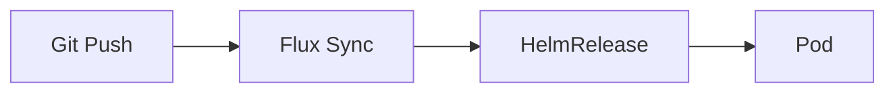

# Writing Documentation as Wisdom Triggers

> **Mission**: Encode durable wisdom in minimal tokens, creating triggers that activate full understanding in any cognitive system.

## Entry Point: Documentation Guides

This is the foundational philosophy. Read this first, then use specialized guides as needed:

- **[writing-capsules.md](./writing-capsules.md)** - Token-efficient concept format (Invariant->Example->Depth)
- **[mermaid-diagram-guide.md](./mermaid-diagram-guide.md)** - Visual documentation reference
- **[Ethos.md](./Ethos.md)** - Documentation values (hard rules, strong guidance)

---

## Documentation Metadata Standard

Every documentation file includes frontmatter defining its purpose and content:

**description** - One-sentence value proposition telling you if this is what you need
- Format: `[What this does] - [key approach/benefit]`
- Should be specific, not vague

**tags** - Specific searchable keywords for concepts, technologies, and techniques covered
- Format: List of concrete terms
- Should NOT duplicate categories or title
- Use capsule names from the document (preserve CamelCase for token efficiency)

**audience** - Who this is written for (indicates style and density)
- Options: `"LLMs"` (high-density, AI-optimized), `"Humans"` (scannable, motivational)

**categories** - Document type and thematic classification with strength indicators
- Format: 1-2 categories
- Strength: `[0-100%]` indicating theme intensity
- Common types: Philosophy, How-To, Reference, Format-Specification

**The principle**: No redundancy. Each field serves a distinct purpose.

---

## The Foundational Insight

Documentation is not a dump of facts but a **lattice of retrieval cues**. Both humans and AI are pattern-completion systems with limited working memory. The goal is not to say everything, but to say the right thing in the right way such that the reader can reconstruct the rest.

**Traditional docs**: 1000s of tokens -> Information overload
**Wisdom triggers**: 10s of tokens -> Pattern activation -> Full understanding

---

## Core Principles

Each principle includes **Applicability** scores:
- **Human**: How much this improves human comprehension (100% = critical)
- **LLM**: How much this improves LLM retrieval (100% = critical)

### 1. Shared Cognition: Design for How Minds Work

**Applicability**: Human 90% | LLM 85%

Both biological and artificial minds exhibit:

- **Limited working memory** - Use chunks of 3-7 concepts
- **Attention biases** - U-shaped focus (primacy/recency effects)
- **Pattern recognition** - Leverage familiar structures
- **Associative retrieval** - Consistent cues trigger memories

**Example**:
```markdown
BAD: "The system uses various approaches depending on factors..."
GOOD:
  1. Secrets -> ExternalSecrets from 1Password
  2. Config -> Jinja2 templates
  3. Manifests -> Flux HelmReleases
```

**Why this matters**: Both human short-term memory (7+/-2 items) and transformer attention windows benefit from chunking and structure.

### 2. Token Economics: Every Token Must Earn Its Place

**Applicability**: Human 30% | LLM 100%

Modern LLMs use subword tokenization that affects concept integrity:

- `CamelCase` -> Often single token
- `hyphenated-terms` -> Usually 3+ tokens
- Common phrases -> Fewer tokens than synonyms
- Novel terms -> Fragment unpredictably

**Example**:
```markdown
GOOD: "HelmRelease" (1-2 tokens)
BAD: "helm release configuration resource" (5-6 tokens)
```

**Why this matters**: Token efficiency directly impacts:
- Context window utilization
- Retrieval precision (fewer tokens = tighter semantic encoding)
- Embedding quality (compact concepts embed better)

### 3. Capsule Architecture: Compress Wisdom Into Invariants

**Applicability**: Human 95% | LLM 90%

Distill each concept into a stable, minimal truth that can be expanded when needed.

**Structure**: See [writing-capsules.md](./writing-capsules.md) for complete format specification.

```markdown
### Capsule: ConceptName

**Invariant**
Core truth in <=30 tokens, timeless, no versions/dates

**Example**
Concrete instance in <=5 lines

**Depth**
- Distinction: How this differs from similar concepts
- Trade-off: What you gain vs lose
- NotThis: Common misconceptions
- SeeAlso: Related capsule names
```

**Why this matters**: Capsules leverage progressive disclosure while ensuring core wisdom is never buried. The invariant provides the retrieval cue, the example grounds it, the depth clarifies boundaries.

### 4. Embedding-First Design: Write for Vector Search

**Applicability**: Human 40% | LLM 95%

Modern systems chunk documents for embedding search. Design for this:

- **Modular sections** that make sense in isolation
- **Topic sentences** that summarize each chunk
- **Semantic boundaries** at paragraph breaks
- **Self-contained chunks** (each under 300 tokens)

**Example**:
```markdown
## [Secrets] 1Password Integration

**Invariant**: ExternalSecrets pull from 1Password; values populate Kubernetes secrets at runtime.

Never commit actual secret values - ExternalSecrets reference `op://Private/1Password/KEY`.
HelmReleases consume secrets via secretRef or envFrom.
```

**Why this matters**: RAG systems retrieve chunks independently. A chunk must convey its meaning without requiring surrounding context.

### 5. Multi-Modal Encoding: Visual + Verbal + Semantic

**Applicability**: Human 100% | LLM 70%

Combine text, structure, and visuals to create multiple retrieval paths to the same wisdom.

**Mermaid diagrams with assistive comments**:


**Critical**: Always escape Mermaid labels containing spaces or special characters with quotes.

See [mermaid-diagram-guide.md](./mermaid-diagram-guide.md) for comprehensive reference.

**Why this matters**: Multiple encoding formats create redundant retrieval paths. If one fails, others succeed.

---

## The Two-Tier Knowledge Architecture

### Tier 1: Knowledge Base (High Fidelity)

Comprehensive, authoritative documents on specific concepts.

**Characteristics**:
- Deep technical details
- Edge cases and exceptions
- Rationale and context
- Implementation guidance
- Location: Specific manifests, configs, scripts

**Example structure**:
```markdown
# Flux HelmRelease Pattern

### Capsule: HelmRelease

**Invariant**
Flux manages Helm deployments declaratively via HelmRelease resources.

**Example**
[Reference to actual HelmRelease file]

**Depth**
[Distinctions, trade-offs, boundaries]

## Detailed Behavior
[Comprehensive explanation]

## Configuration Guide
[Patterns with examples]

## Edge Cases
[What happens when...]
```

### Tier 2: Synthesis Documents (Accessible)

Practical guides that combine multiple concepts.

**Characteristics**:
- 80% of value in 20% of tokens
- Clear links to source configs
- Unified examples showing interaction
- Task-oriented organization
- Location: `docs/ai-context/`

**Example structure**:
```markdown
# Deploying an App (Synthesis)

### Capsule: AppDeployment

**Invariant**
Apps deploy via the install.yaml + HelmRelease + ExternalSecret triad.

**Core Components** (details in manifests):
- [Install.yaml](kubernetes/main/apps/...) - Flux Kustomization wrapper
- [HelmRelease](kubernetes/main/apps/...) - Helm configuration
- [ExternalSecret](kubernetes/main/apps/...) - Secret population

**Unified Workflow**:
1. Create app folder structure
2. Define HelmRelease with bjw-s/app-template
3. Configure ExternalSecret for 1Password
4. Commit and push
5. Watch Flux reconcile
```

**Pattern**: Synthesis documents reference specific files but don't duplicate content.

---

## Success Metrics

Your documentation succeeds when:

- Readers grasp concepts in seconds, not minutes
- AI finds and extracts exactly what's needed
- Knowledge transfers intact across contexts
- Updates preserve retrieval while adding detail
- The system becomes navigable

---

## Quick Reference

### When to Use Each Format

| Need | Format | Guide |
|------|--------|-------|
| Token-efficient concept | Capsule | [writing-capsules.md](./writing-capsules.md) |
| Visual relationships/flows | Mermaid diagram | [mermaid-diagram-guide.md](./mermaid-diagram-guide.md) |
| Comprehensive concept explanation | Knowledge Base (Tier 1) | This guide |
| Quick task-oriented guide | Synthesis (Tier 2) | This guide |

### Essential Patterns

**Chunking** (3-7 items):
```markdown
GOOD:
1. Create folder structure
2. Define HelmRelease
3. Configure secrets
4. Validate and push

BAD (no structure):
"Create the folder, add the HelmRelease, set up secrets, validate, push, and monitor."
```

**Primacy/Recency** (critical info at start/end):
```markdown
GOOD:
**Critical**: Main and staging clusters are independent; changes affect only one cluster.
[explanation]
Remember: Always specify which cluster you're working on.

BAD:
[long explanation]
"Oh by the way, clusters are independent."
```

**Progressive Disclosure** (overview -> detail -> comprehensive):
```markdown
GOOD:
CLAUDE.md: "Two clusters: main (production) + staging (testing)" (with link)
->
ARCHITECTURE.md: Why clusters are separate, how they differ, what they share
->
kubernetes/main/ and kubernetes/staging/: Complete configurations

BAD:
Repeating same content at each level
```

### Token Optimization

| Instead of | Use | Tokens Saved |
|------------|-----|--------------|
| "kubernetes manifest file" | manifest | 2-3 |
| "the process of deploying" | deployment | 2-3 |
| "in order to" | to | 2 |
| "due to the fact that" | because | 3 |
| "at this point in time" | now | 3 |

### Mermaid Quick Rules

1. **NEVER diagram linear sequences** (use lists)
2. **Quote labels with spaces**: `A["User Request"]`
3. **Add meaning comments**: `%% MEANING: What this represents`
4. **Explain colors**: `%% COLOR: Green = success, Red = error`
5. **<12 nodes per diagram** (split if more)

See [mermaid-diagram-guide.md](./mermaid-diagram-guide.md) for complete reference.

---

## The Meta-Pattern

This guide demonstrates the principles:
- **Capsules** introduce each concept
- **Examples** ground abstractions
- **Two-tier** structure (this guide + specialized guides)
- **Progressive** disclosure throughout
- **Links** instead of duplication

Remember: We're not writing documentation. We're encoding **wisdom triggers** that activate understanding in any mind that encounters them.

---

*Now read the specialized guides and apply these principles.*
